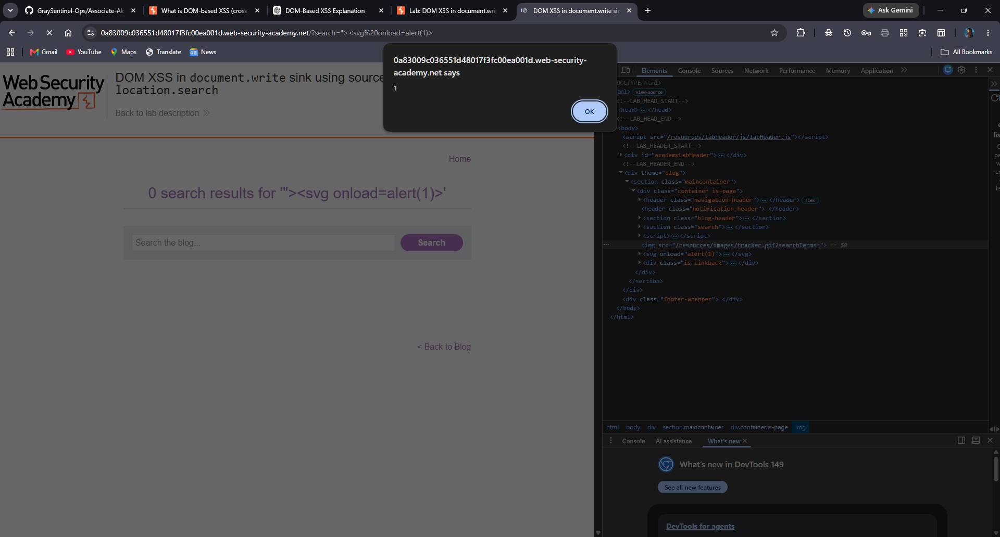

# DOM XSS Research
**Date:** 18 June 2026  
**Operator:** Akshat Tiwari  
**Source:** PortSwigger Web Security Academy  

## What is DOM XSS?
DOM-based XSS occurs when JavaScript takes data from 
an attacker-controlled source and passes it to a sink 
that executes dynamic code — entirely client-side, 
without server involvement.

## Lab Solved
**Lab:** DOM XSS in document.write sink using location.search  
**Payload:** `"><svg onload=alert(1)>`

## Analysis
- **Source:** location.search  
- **Sink:** document.write()  
- **How it worked:** Application passed location.search 
directly into document.write() without sanitization. 
Injected payload escaped existing HTML attribute, 
created SVG element, executed JS via onload event.

## Screenshots

## Key Takeaways
- Never pass user-controlled input directly to dangerous sinks
- document.write() is a high-risk sink
- SVG onload is effective payload when script tags are filtered