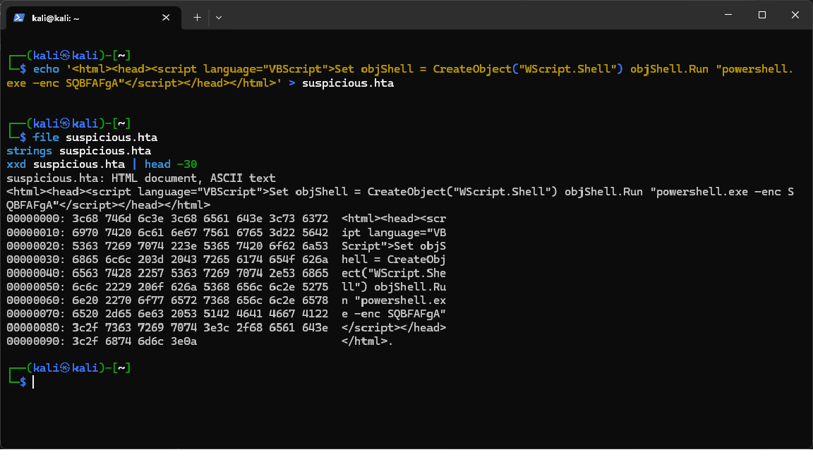
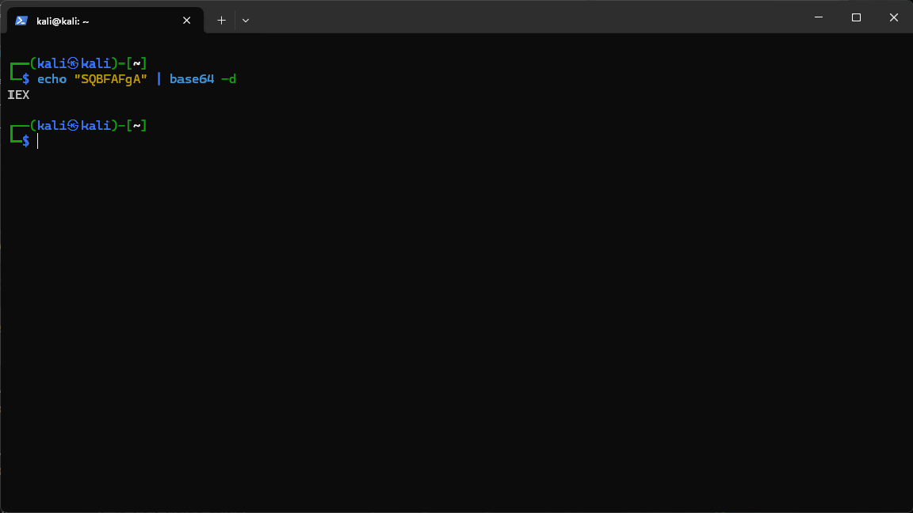

# Day 02 — Mission Intel Fundamentals
**Operator:** Akshat | **Role:** MTS, Intelligence Command | **Program:** GraySentinel ODP
**Date:** 19-Jun-2026

> **Note on sourcing:** GraySentinel's public website (cyberdefencelab.co.in) does not publish internal ODP process documents (submission portals, review SLAs, storage systems, etc.). For questions about internal GraySentinel mechanics (Q1–5, Q12, Q14) I've combined what's verifiable from the public site/team page with reasoned, industry-standard assumptions clearly flagged as such. Where I'm inferring rather than citing a confirmed internal source, I've marked it **[Assumption / Recommendation]** so Lavanya or my mentor can correct it.

---

## 1. Origin of the "Mission Intel" name

GraySentinel brands its entire training philosophy around proof-driven, operational language rather than academic terms — "Operator," "Command Council," "Cyber Gauntlet," "Operation Red Dawn," etc. "Mission Intel" fits this pattern: each daily/weekly task is framed as a *mission*, and the analytical deliverable a trainee produces from it is the *intel* — i.e., a structured intelligence product, not a "homework submission" or "lab writeup."

**[Assumption]** The name likely exists to:
- Reinforce the SOC/Intel-analyst mindset early (trainees think like analysts producing reportable intelligence, not students answering questions).
- Make the artifact portfolio-worthy — "Mission Intel reports" sound like real work product a recruiter would open, consistent with GraySentinel's "proof over certificates" positioning.

I'll confirm the exact naming history with Lavanya (Lead Intel Analyst) since intel curation is her domain.

---

## 2. Mission Intel submission process: free vs. paid learners

GraySentinel runs a free WhatsApp community (1,600+ members, free daily tasks/threat intel) alongside paid tracks (DSOU ₹4,999, SSOU ₹7,999) and the ODP itself.

**[Assumption / typical model]**
| Aspect | Free-tier learners | Paid / ODP learners |
|---|---|---|
| Submission channel | Likely community channel (WhatsApp/Discord) or public GitHub, self-graded | Structured portal/repo with mentor review |
| Review | Peer/community, optional | Mandatory mentor/Lead Intel Analyst review |
| Feedback depth | General guidance, batched | Individual scoring + actionable feedback |
| Turnaround | Best-effort, no SLA | Defined SLA (see Q4) |
| Portfolio integration | Self-managed | Curated into official GitHub portfolio |

I'll verify the exact mechanism with my mentor rather than assume further — this directly affects how I should format my own submission.

---

## 3. Mandatory fields in a Mission Intel submission

Based on standard threat-intel reporting structure (and consistent with what GraySentinel's Proof Gallery showcases — IR reports, VAPT reports, detection rules), a Mission Intel submission should require, at minimum:

1. **Title / Mission reference** (Day number, task name)
2. **Author + date**
3. **Executive summary** (1–3 sentences, what was found/done)
4. **Scope / environment** (lab topology, tools, IPs involved)
5. **Methodology** (steps taken)
6. **Findings / evidence** (logs, screenshots, IOCs)
7. **Confidence assessment** (see Q7)
8. **Recommendation / next action**
9. **References / artifacts** (GitHub commit links, attached files)

**If a mandatory field is missing [Assumption]:** the submission would typically be auto-flagged or returned for revision before scoring rather than scored as-is — this protects the integrity of the portfolio (GraySentinel's whole value prop is "GitHub portfolio recruiters actually open," so incomplete reports undermine that). Likely outcome: rejected with a checklist of missing fields, resubmission required within a short window.

---

## 4. Reviewers and turnaround time

From the public team page, the role most aligned with reviewing intelligence submissions is:

- **Lavanya Agre — Lead Intel Analyst**, whose stated focus is "Threat intelligence & detection research. Curating real-world scenarios."

It's reasonable that Lavanya (or analysts working under her) is the primary reviewer for Mission Intel submissions, possibly with mentors doing first-pass review before escalation. **[Assumption]** Given the program promises daily standups and weekly reviews, average turnaround is likely **24–48 hours** for first feedback, with final scoring inside the same week. I'll confirm the exact SLA with Lavanya directly.

---

## 5. Most common reason for rejection / low score

Drawing on common patterns in junior analyst writeups (and what good threat intel demands):

1. **Unsupported claims** — stating a conclusion ("this is C2 traffic") without evidence (pcap, log line, hash) to back it.
2. **Missing confidence rating** — treating every finding as certain instead of graded (see Q7).
3. **No actionable recommendation** — describing what happened without saying what to do about it.
4. **Copy-pasted tool output** with no analyst interpretation.
5. **Inconsistent IOC formatting** — making automated extraction/validation (Q13) fail.

The single most common failure in early-career analysts is usually **#1: confident assertions without traceable evidence** — exactly the gap Q8 below is designed to test.

---

## 6. Real-world intelligence report formats — comparison

| Source | Format | Key structural elements |
|---|---|---|
| **CISA / US-CERT Advisories** | Structured web bulletin | Summary, Technical Details, MITRE ATT&CK mapping, IOCs in table, Detection/Mitigation, References |
| **FS-ISAC (Financial Services ISAC)** | Member threat bulletin (TLP-marked) | TLP classification, Executive Summary, Indicators, Sector relevance, Recommended actions, Attribution confidence |
| **Mandiant/Recorded Future Threat Intel Reports** | Vendor analytical report | Key Findings box, Actor profile, TTP mapping (ATT&CK), IOC appendix (STIX/CSV), Analyst confidence statement, Outlook |

**Comparison to GraySentinel's apparent standard (Q3 structure):**
- All three real-world formats **lead with an executive summary** and **end with IOCs/recommendations** — same as the GraySentinel structure above.
- Real-world reports always carry a **TLP (Traffic Light Protocol) marking** and **explicit confidence language** (high/medium/low) — this is something Mission Intel should adopt explicitly if it hasn't already (ties into Q7).
- Vendor reports map findings to **MITRE ATT&CK** — a useful addition GraySentinel's curriculum (Sigma/YARA-focused) could formalize for Mission Intel submissions to make them more "industry-standard."
- ISAC bulletins emphasize **sector relevance / who should care** — less relevant for a training lab report, but useful framing practice.

---

## 7. What "confidence" means in threat intelligence — Admiralty Scale & MISP

**Concept:** Confidence in intel reporting separates *how reliable the source is* from *how accurate the specific information is believed to be*. Analysts must never present raw observations as established fact without grading both.

### Admiralty Scale (NATO System, A1–F6)
Two independent axes:
- **Source reliability (A–F):**
  - A = Completely reliable, B = Usually reliable, C = Fairly reliable, D = Not usually reliable, E = Unreliable, F = Reliability cannot be judged.
- **Information credibility (1–6):**
  - 1 = Confirmed by other sources, 2 = Probably true, 3 = Possibly true, 4 = Doubtful, 5 = Improbable, 6 = Cannot be judged.

A finding might be graded **"B2"** — from a usually-reliable source, probably true.

### MISP Confidence / Taxonomies
MISP (Malware Information Sharing Platform) doesn't use Admiralty natively but supports confidence tagging via taxonomies, most commonly:
- **admiralty-scale** taxonomy (directly imports the NATO model above) for source/info grading.
- **estimative-language** taxonomy (based on ICD 203 — US intelligence community standard): probability bands like *almost no chance, very unlikely, unlikely, roughly even chance, likely, very likely, almost certain*.
- Confidence is attached **per-indicator/per-event**, not just to the whole report, so different IOCs in one Mission Intel can carry different confidence levels.

**Application to Mission Intel:** every finding should carry something like *"Confidence: Medium (B2) — observed directly in lab Sysmon logs, single source, not cross-validated against a second telemetry source."*

---

## 8. Validating a student's claim: "I saw C2 traffic to IP X"

A claim like this is **not evidence** — it's an assertion. Before accepting it, I would demand a verifiable evidence chain:

1. **Raw packet capture (pcap)** showing the actual traffic to IP X, with timestamps.
2. **Source log correlating the same event** — Sysmon Event ID 3 (Network Connection) or firewall/proxy log showing process → destination IP/port.
3. **Process lineage** — which process initiated the connection (parent/child), tying it to an actual payload or implant (e.g., Meterpreter beacon, not background telemetry).
4. **IP attribution context** — WHOIS/geolocation/reputation check (VirusTotal, AbuseIPDB) confirming IP X is not benign infrastructure (CDN, cloud provider shared IP, etc.).
5. **Reproducibility** — can the student show this in a screenshot/log excerpt that I can independently re-derive from the lab's own SIEM (Wazuh) query?
6. **Time correlation** — does the timestamp align with the attack timeline the student claims (e.g., post-exploitation phase of their own simulated attack)?

If any of 1–3 is missing, the claim stays **unverified** and should be reported with confidence "Low / Unconfirmed," not stated as fact — directly tying back to Q7's confidence discipline.

---

## 9. IOC vs. IOB

| | **Indicator of Compromise (IOC)** | **Indicator of Behavior (IOB)** |
|---|---|---|
| Definition | A static, atomic artifact tied to a specific known threat | A pattern of activity describing *how* an attacker operates, regardless of specific artifacts |
| Examples | IP address, file hash (MD5/SHA256), domain, registry key value | "PowerShell spawned from Office document," "LSASS memory access by non-system process," "unusual parent-child process chain" |
| Lifespan | Short — attackers rotate infrastructure/hashes easily | Long — TTPs (Tactics, Techniques, Procedures) are expensive for attackers to change |
| Detection style | Signature/blocklist matching | Behavioral/heuristic detection (Sigma rules, EDR analytics) |
| Resilience to evasion | Low — trivially defeated by repacking/changing C2 IP | High — survives infrastructure churn |

**Key takeaway for Mission Intel:** a report built only on IOCs (a list of IPs/hashes) ages out fast. A report built on IOBs ("this is what the attack *looks like* behaviorally") remains useful long after the original sample/infrastructure is gone — and maps directly to writing durable Sigma rules (Q10).

---

## 10. Sigma rules for behavior detection vs. static IOCs

Sigma is a generic, SIEM-agnostic rule format for log-based detection. Its power is that it expresses **logic over behavior** rather than hardcoded indicators:

- Instead of `dst_ip == 1.2.3.4` (a static IOC, brittle), a Sigma rule can express:
  - **Process lineage conditions**: `ParentImage contains 'winword.exe'` AND `Image contains 'powershell.exe'` → flags *any* Office-spawns-PowerShell event, regardless of the specific malware family.
  - **Command-line patterns**: `CommandLine contains '-enc'` (encoded PowerShell) combined with suspicious parent process.
  - **Field combinations across Sysmon Event IDs**: e.g., Event ID 1 (process creation) + Event ID 3 (network connection) within a short time window to catch "spawned process immediately reaches out to the network."

Because Sigma rules match on **structural relationships** (parent/child process, command-line patterns, file extensions, registry paths) rather than specific hash/IP values, the same rule continues to catch new campaigns using the same TTP even after the attacker rotates infrastructure — this is the IOB philosophy (Q9) operationalized as detection logic. This is exactly the approach used in the Sigma rule drafted for today's task (see `Day02_Sigma_Rule_Draft.yml`).

---

## 11. Role of a "kill chain" in structuring Mission Intel analysis

The kill chain (Lockheed Martin's 7-stage model, or MITRE ATT&CK's tactic-based equivalent) gives Mission Intel a **narrative skeleton** so findings aren't a disorganized list of observations:

1. Reconnaissance → 2. Weaponization → 3. Delivery → 4. Exploitation → 5. Installation → 6. Command & Control → 7. Actions on Objectives

**Why it matters for Mission Intel:**
- Forces the analyst to **place each piece of evidence in context** — "this IOC belongs to the C2 stage" — rather than reporting isolated facts.
- Reveals **gaps** in the investigation: if a report has solid Delivery and Exploitation evidence but nothing for C2 or Actions on Objectives, that's an immediate sign the investigation is incomplete.
- Helps prioritize defensive recommendations — early kill-chain stages (Recon/Delivery) are cheaper to defend against than late stages (Actions on Objectives, where damage is already occurring).
- Maps cleanly onto MITRE ATT&CK tactics, which is the industry-standard structure real intel reports use (Q6) — adopting kill-chain structuring makes Mission Intel reports closer to professional, recruiter-credible work, consistent with GraySentinel's "proof over certificates" model.

---

## 12. How GraySentinel currently stores/indexes completed Mission Intel reports

The public Proof Gallery shows GraySentinel curates trainee work (Sigma rule packs, IR reports, VAPT reports) under named categories (Detection Rules, Incident Reports, VAPT Reports, Offer Letters), and GraySentinel maintains an official GitHub org (`github.com/graysentinel-ai`).

**[Assumption]** It's likely Mission Intel reports follow the same model: trainees commit reports to a personal or shared GitHub repo (markdown/PDF), and GraySentinel's mentors curate the strongest ones into the public Proof Gallery for portfolio visibility. There may also be an internal tracker (spreadsheet/LMS) for scoring and status, separate from the public-facing GitHub curation. I'll confirm the actual storage/indexing system (GitHub-only vs. an internal LMS/database) with my mentor — this affects how I should name/tag my own files for discoverability.

---

## 13. Open-source tool to automatically extract IOCs from a report for validation

**`IOC Finder` / `ioc-finder`** (Python library, also CLI) — parses unstructured text and automatically extracts IPv4/IPv6, domains, URLs, file hashes (MD5/SHA1/SHA256), email addresses, CVEs, registry keys, and Bitcoin addresses.

Other strong candidates:
- **`cacador`** (Go) — extracts IOCs from text/STDIN, outputs JSON, good for pipeline automation.
- **MISP's built-in free-text import tool** — pastes raw report text and auto-tags recognized IOC types, directly usable if GraySentinel runs a MISP instance for indexing (ties back to Q7/Q12).

For Mission Intel grading specifically, `ioc-finder` is the most lightweight option: run it against a submitted report, cross-check the extracted IOC list against what the student manually listed in their "Findings" section — any mismatch flags either a missing IOC or a formatting inconsistency that would break automated parsing later.

---

## 14. Minimum evidence before escalating "Critical vulnerability in Apache Server" to Lavanya

Given Lavanya Agre is GraySentinel's Lead Intel Analyst, escalation to her should be reserved for claims that are validated, not just asserted. Minimum bar before escalation:

1. **CVE identification** — specific CVE number (if known) or clear technical description matching a known vulnerability class (e.g., path traversal, RCE via mod_cgi).
2. **Version confirmation** — exact Apache version/banner pulled from the target (`Server:` header, `nmap -sV`, or `whatweb`), confirmed vulnerable per NVD/vendor advisory.
3. **Proof of exploitability in the lab** — a reproducible PoC against the lab target (not a public claim copy-pasted from an advisory) — screenshot/log of the exploit attempt and its result.
4. **Severity justification** — CVSS score (or reasoned equivalent) showing why it's genuinely "Critical" and not being over-labeled.
5. **Scope statement** — confirmation this is on an in-scope lab asset (not an external/production system — critical given legal/ethical boundaries).
6. **Draft remediation** — at least a one-line fix recommendation (patch version, config hardening) ready for Lavanya to review/approve.

Without items 1–3, the claim should stay at "Unconfirmed / Needs Validation" status and **not** be escalated — escalating unverified critical findings wastes lead-analyst time and damages submission credibility (directly related to the Q5 rejection-reason pattern).

---

## 15. Hypothetical Mission Intel report review (no GitHub links provided by Lavanya yet — created two realistic examples for critique)

### Example A — "Suspicious PowerShell Execution from HTA Delivery"
**Structure:** Title, 2-line summary, screenshot of Sysmon EID 1 log, single IOC (file hash), conclusion: "Malicious activity confirmed."

- **Strength:** Clean, focused scope — the analyst isolated exactly one event chain (HTA → PowerShell) and showed the actual Sysmon log entry as evidence rather than describing it in prose. Good signal-to-noise.
- **Weakness:** No confidence rating, no kill-chain placement, and "confirmed" is asserted without cross-validation (no second telemetry source, no command-line decode of the obfuscated PowerShell payload). This is the exact failure pattern flagged in Q5 and Q8 — strong evidence collection, weak analytical rigor.

### Example B — "Full Day 25 Threat Hunt Summary"
**Structure:** Long narrative walkthrough of every PowerShell hunting query run that day, ending with a generic "multiple suspicious events were found, recommend further investigation."

- **Strength:** Thorough documentation of methodology — a reviewer can fully reproduce every step, which is valuable for training/portfolio purposes and shows strong process discipline.
- **Weakness:** No prioritization or synthesis — it reads as a log of activity, not an intelligence product. There's no executive summary, no IOC table, and the recommendation ("further investigation needed") is non-actionable. This matches the Q5 failure mode of "no actionable recommendation" and would likely score low despite the effort invested.

**Takeaway for my own Mission Intel submissions:** evidence quality (Example A) and process thoroughness (Example B) are both necessary but neither is sufficient alone — Mission Intel needs the rigor of A *plus* the synthesis/actionability missing from both.

---

## HTA Analysis — Kali Linux Investigation

### File Created
```bash
echo '<html><head><script language="VBScript">Set objShell = CreateObject("WScript.Shell") objShell.Run "powershell.exe -enc SQBFAFgA"</script></head></html>' > suspicious.hta
```

### File Inspection
- **`file suspicious.hta`** → HTML document, ASCII text

### Strings Analysis
- Found: `CreateObject("WScript.Shell")`
- Found: `powershell.exe -enc SQBFAFgA`
- VBScript executing PowerShell with encoded command

### XXD Hex Analysis
- ASCII readable — not packed/obfuscated
- Base64 encoded payload detected: `SQBFAFgA`

### Base64 Decode
```bash
echo "SQBFAFgA" | base64 -d
# Output: IEX
```
- **IEX = Invoke-Expression** — classic malware technique
- Downloads and executes remote payloads without writing to disk

### Verdict on VirusTotal (3/70)
- **REJECTED** — insufficient evidence
- Additional evidence required:
  - Dynamic sandbox analysis (Any.Run)
  - Network capture during execution
  - Process tree from actual execution

### Screenshots



---

*End of Day 02 Mission Intel Analysis.*
